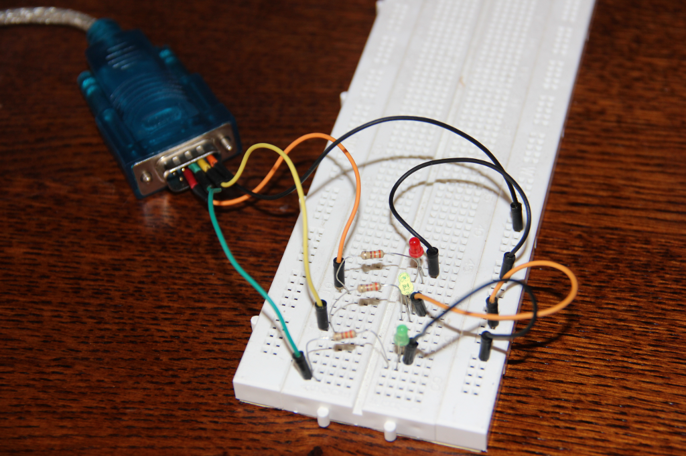

# pyap (PYthon Alert Processor  / P....n Y'A Personne)

Pyap is a little tools used to process alert sent by differents ways.

_Previously named pynotif, I need to rename it because of conflicted
naming with python-notify from libnotify._

## History

I would like to get physical notifications to be informed when a new event
occurs on my computer.

I would like a solution with less electronic as possible.


Many solutions exist :

- using an [arduino](https://www.arduino.cc/en/Main/arduinoBoardNano)
- using commercial solutions like [blink(1)](http://blink1.thingm.com/)
- or DIY solution

I've chosen DIY solution and begun begun with hardware I have in my cupboard,
a USB/Serial cable.

I create the first python class [Db9](#Serial Db9)

## Serial Db9

Inspired by a linuxfocus article on [sled](http://linuxfocus.org/English/January2001/article186.shtml)
the Db9 class use ioctl to switch on/off the output pins.

The file [pyap-serial](tests/pyap-serial) is an example.


The tests are made on this hardware

- pin5 is the Ground
- pin4 is the green led for ok status
- pin7 is the red led for critical status
- pin3 is unusable this way.
- Two 1k resistors protect each led





Just test using `python tests/pyap-serial <tty>`

## pyap

Because serial port must be opened to keep the light on, I had to create a
program that controls the lights and receives change orders.

[Pyap](pyap) is a server listening for http requests and poll remote status
through http requests to switch leds on/off.

Replace __PWD__ in tests/tests.conf according to your path and run the server:

```
$ export PYTHONPATH=$(pwd); bin/pyap -v --server --conf=tests/test.conf
[+] -  Using config file tests/test.conf
[+] -  Blink(1) found
[!] -  serial_led not found
[+] -  Running http poller
[i] -  [+] Get status from file:///home/pi/src/pyap/tests/status/n1
[+] -  Serving HTTP on port 8080...
[i] -  poller status ( {"services":{ "ok":1, "warn":0, "crit":0, "unknown":0}} )
[i] -  [+] Get status from file:///home/pi/src/pyap/tests/status/n2
[i] -  poller status ( {"services":{ "ok":0, "warn":0, "crit":0, "unknown":0}} )
[i] -  Global status ( {'crit': 0, 'warn': 0, 'ok': 1, 'unknown': 0} )
^C[+] -  End asked by user...bye bye !
[+] -  Waiting end of process
```

Test the commands:

```
curl http://127.0.0.1:8080/alert/ok
curl http://127.0.0.1:8080/alert/warning
curl http://127.0.0.1:8080/alert/critical
curl http://127.0.0.1:8080/alert/ack

curl http://127.0.0.1:8080/alert/security
curl http://127.0.0.1:8080/alert/security/ack
```


## http poller

Actually `http poller` is a thread in `pyap` as a test code. It must be coded
in it own program. Pyap must not do polling AND sending alerts.

If urls are provided in conf file or in parameters, a thread is started to
poll informations from all the url. Request must returns json
values of services status in the form :
```
{"services":{ "ok":123, "warn":1, "crit":0, "unknown":0}}
```

## Nagios/Shinken http poller

The `data/nagios2json.php` file can be used on nagios/shinken server as a http
poller. The php code uses [mklivestatus](http://mathias-kettner.de/checkmk_livestatus.html).

## blink(1)

Blink(1) led is now usable. see file `blink1-python-update.sh`

## TODO

[See](https://github.com/fccagou/pyap/blob/master/TODO.txt)

